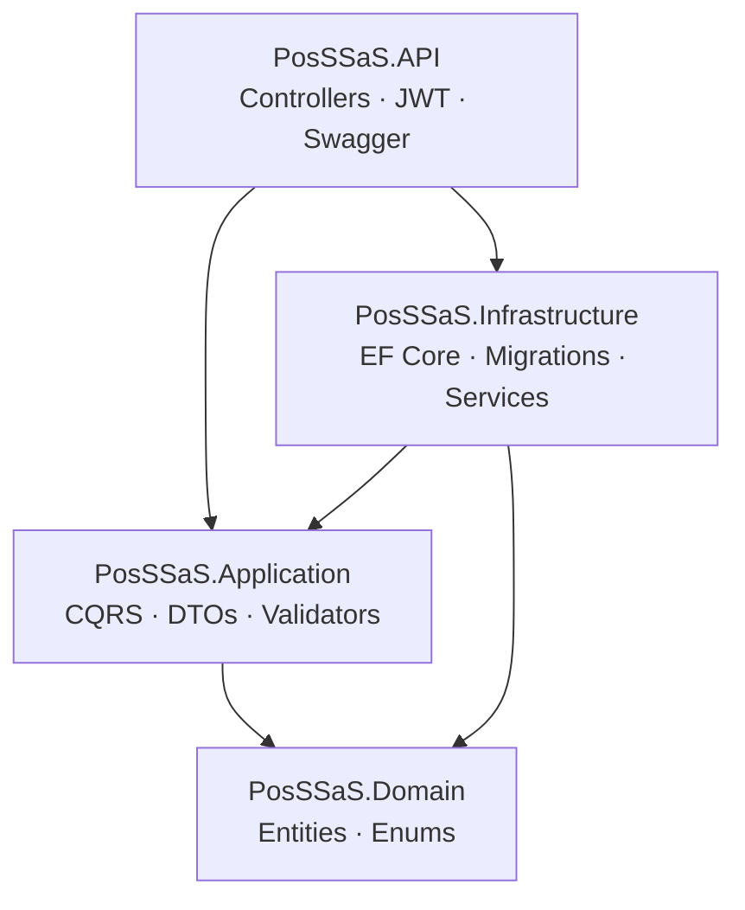
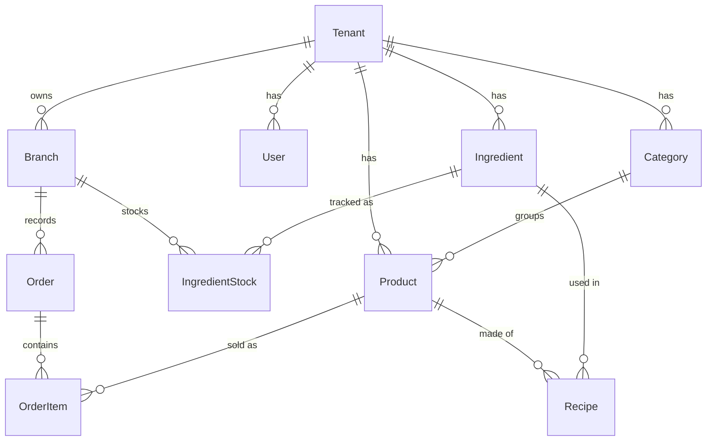

<div align="center">

# 🧋 PosSSaS — Multi-Tenant POS SaaS

**A production-style Point-of-Sale backend for F&B chains, built with ASP.NET Core 8 and Clean Architecture.**

[](https://dotnet.microsoft.com/)
[](https://learn.microsoft.com/ef/core/)
[](https://www.microsoft.com/sql-server)
[](https://github.com/jbogard/MediatR)
[](https://swagger.io/)
[](LICENSE)

</div>

---

## 📖 Overview

**PosSSaS** is the backend "heart" of a Software-as-a-Service Point-of-Sale platform aimed at
multi-branch food & beverage businesses (the seeded demo models a **bubble-tea chain**).

A single deployment serves many **tenants** (businesses), each owning multiple **branches**.
Data is strictly isolated at two levels — **tenant** and **branch** — enforced globally by
EF Core query filters, so a cashier at one branch can never see or touch another branch's data.

The API is designed to be consumed by multiple clients:

| Client | Tech | Audience |
| --- | --- | --- |
| **POS Client** | C# WinForms (HTTP, not direct SQL) | Cashiers at the counter |
| **Admin Dashboard** | React + TypeScript | Chain owners / managers |
| **Swagger UI** | Built-in | Developers / reviewers |

> This repository contains the **backend API**. Client apps live in their own repositories
> and connect exclusively over HTTP.

---

## 🏛️ Architecture

The solution follows **Clean Architecture** — dependencies always point inward, and the
Domain layer knows nothing about frameworks or databases.

```
┌──────────────────────────────────────────────────────────────┐
│                       PosSSaS.API                              │
│   Controllers · JWT auth · Swagger · Exception middleware      │
│   Static test console (wwwroot)                                │
└───────────────┬────────────────────────────┬───────────────────┘
                │                            │
                ▼                            ▼
┌──────────────────────────────┐   ┌──────────────────────────────┐
│     PosSSaS.Application       │   │    PosSSaS.Infrastructure     │
│   CQRS (MediatR) commands/    │   │   EF Core DbContext + global  │
│   queries · DTOs · validators │   │   query filters · migrations  │
│   pipeline behaviors          │   │   seeder · JWT · BCrypt        │
└───────────────┬──────────────┘   └───────────────┬──────────────┘
                │                                  │
                └──────────────┬───────────────────┘
                               ▼
                ┌──────────────────────────────┐
                │        PosSSaS.Domain         │
                │  Entities · Enums · base      │
                │  abstractions (no deps)       │
                └──────────────────────────────┘
```



### Layers

| Project | Responsibility | Key dependencies |
| --- | --- | --- |
| **PosSSaS.Domain** | Entities, enums, base abstractions (`BaseEntity`, `IMustHaveTenant`, `IMustHaveBranch`). Zero external deps. | — |
| **PosSSaS.Application** | Use cases as CQRS handlers, DTOs, FluentValidation validators, MediatR pipeline behaviors, app-level interfaces. | MediatR, FluentValidation, EF Core (abstractions) |
| **PosSSaS.Infrastructure** | EF Core `DbContext` with multi-tenant/branch query filters, entity configurations, migrations, seeder, JWT + BCrypt services. | EF Core SqlServer, JWT, BCrypt |
| **PosSSaS.API** | Thin controllers delegating to MediatR, JWT bearer auth, Swagger, global exception middleware, static test UI. | ASP.NET Core, Swashbuckle |

---

## ✨ Key Features

- 🏢 **Multi-tenant + multi-branch isolation** — enforced globally via EF Core `HasQueryFilter`,
  driven by the authenticated principal (`ICurrentUserService`). No manual `WHERE TenantId = ...` in handlers.
- 🔐 **JWT authentication** with role-based access (`Admin`, `Cashier`) and BCrypt password hashing.
- 🧾 **Order creation with automatic stock deduction** — placing an order decrements ingredient
  stock per branch according to each product's recipe (Bill of Materials), inside a DB transaction.
  Throws `InsufficientStockException` when a branch can't fulfil the order.
- 📦 **Per-branch inventory** — the same ingredient can be in stock at one branch and out at another.
- 🧰 **CQRS with MediatR** — every use case is an isolated command/query handler.
- ✅ **Validation pipeline** — FluentValidation runs automatically as a MediatR behavior.
- 🗃️ **Auto-migrate + seed on startup** — a demo bubble-tea chain is created on first run.
- 📜 **Live Swagger / OpenAPI** with Bearer token support — try endpoints from the browser.

---

## 🧩 Domain Model



---

## 🚀 Quick Start

### Prerequisites
- [.NET 8 SDK](https://dotnet.microsoft.com/download/dotnet/8.0)
- SQL Server — LocalDB (Windows), or any SQL Server 2019+ instance / Docker container

### Run locally

```bash
git clone https://github.com/<your-username>/PosSSaS.git
cd PosSSaS

# 1. Set a real JWT signing key (≥ 32 chars) — never commit secrets
dotnet user-secrets set "Jwt:Key" "a-very-long-random-secret-at-least-32-chars" \
  --project src/PosSSaS.API

# 2. Run — migrations are applied and demo data is seeded automatically
dotnet run --project src/PosSSaS.API
```

Then open **`https://localhost:<port>/`** — the static test console — or
**`/swagger`** for the full API explorer.

> The database schema and demo data are created on first launch; no manual
> `dotnet ef database update` is required.

---

## 🔑 Demo Accounts

| Username | Password | Role | Scope |
| --- | --- | --- | --- |
| `admin` | `admin123` | Admin | All branches of the demo tenant |
| `cashier` | `cashier123` | Cashier | Locked to *Chi nhánh 1 - Quận 1* |

**Seeded demo tenant** `DemoMilkTeaShop`: 2 branches, 3 categories, 5 ingredients,
3 products with recipes, and per-branch stock (Branch 2 is intentionally low on
tapioca to demonstrate branch-scoped stock-out scenarios).

---

## 🌐 API Endpoints

All routes are prefixed with `/api`. All except `auth` and `tenants/register` require a Bearer token.

| Method | Endpoint | Description |
| --- | --- | --- |
| `POST` | `/api/auth/login` | Authenticate, receive a JWT |
| `POST` | `/api/tenants/register` | Onboard a new tenant |
| `GET` `POST` | `/api/branches` | List / create branches |
| `GET` `POST` | `/api/categories` | List / create categories |
| `GET` `POST` `PUT` `DELETE` | `/api/products` | Product CRUD |
| `GET` `POST` `PUT` `DELETE` | `/api/ingredients` | Ingredient CRUD |
| `GET` `POST` | `/api/stock` | View / adjust per-branch stock |
| `GET` `POST` | `/api/recipes` | View / set product recipes (BOM) |
| `GET` | `/api/orders` | List orders (filter by date range) |
| `GET` | `/api/orders/{id}` | Order detail |
| `POST` | `/api/orders` | Create order (deducts stock by recipe) |

### Authenticating in Swagger
1. `POST /api/auth/login` with a demo account → copy the `token`.
2. Click **Authorize** 🔓 (top-right), enter `Bearer <token>`.
3. Call any secured endpoint, e.g. `POST /api/orders`.

---

## 🛠️ Tech Stack

| Concern | Choice |
| --- | --- |
| Framework | ASP.NET Core 8 Web API |
| ORM | Entity Framework Core 8 (SQL Server) |
| Application pattern | CQRS via MediatR 12 |
| Validation | FluentValidation 11 |
| Auth | JWT Bearer + BCrypt.Net |
| API docs | Swashbuckle (Swagger / OpenAPI) |

---

## 📂 Project Structure

```
PosSSaS/
├── PosSSaS.sln
└── src/
    ├── PosSSaS.Domain/           # Entities, enums, base abstractions
    ├── PosSSaS.Application/      # CQRS handlers, DTOs, validators, behaviors
    ├── PosSSaS.Infrastructure/   # EF Core, migrations, seeder, JWT, BCrypt
    └── PosSSaS.API/              # Controllers, middleware, Swagger, test UI
```

---

## 🗺️ Roadmap

- [x] Backend API (Clean Architecture, multi-tenant, CQRS)
- [x] Live Swagger / OpenAPI documentation
- [ ] Reporting endpoints (revenue summary, top products, low-stock alerts)
- [ ] CI/CD + Docker Compose
- [ ] Cloud deployment (live demo URL)
- [ ] WinForms POS client (HTTP-based)
- [ ] React admin dashboard

---

## 📄 License

Distributed under the [MIT License](LICENSE).
